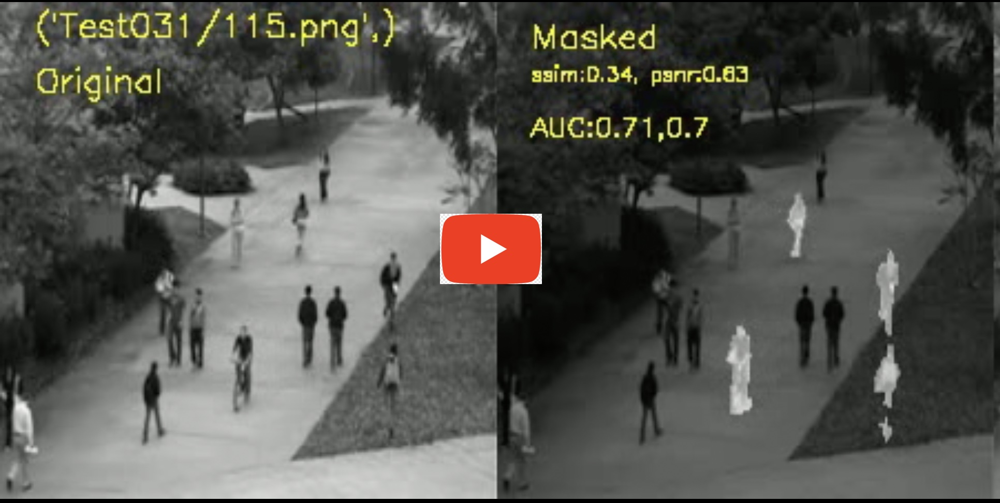

# DENOISING AUTOENCODER WITH TEMPORAL SHIFT MODULE FOR VIDEO ANOMALY DETECTION

- Video anomaly detection studies predominantly rely on 3D CNNs and convolutional LSTMs, serving as primary deep learning architectures for capturing novel spatial and temporal events within video streams.

- Despite their effectiveness, training and deploying these models pose challenges due to the high computational complexity they demand.

- A novel approach employs the Temporal Shift Module (TSM), facilitating the sharing of data between frames. This module, integrated with 2D convolution layers, accomplishes pseudo-3D convolutions for tasks like action recognition and video inpainting.

- The TSM module is notably efficient in learning spatial and temporal data, boasting over a 3% latency increase without introducing additional computational demands compared to 2D convolution layers.

- This research introduces the utilization of the TSM module to acquire long-term temporal information within denoising-based deep learning models (TSM-DAE) designed for anomaly detection.

- In assessing the enhancement in model performance, a base model (2DConv-DAE), replicating image denoising autoencoders, is implemented with an identical count of learnable parameters as TSM-DAE.

- When trained and evaluated with UCSDped1 and UCSDped2 datasets, TSM-DAE outperforms the base model, achieving AUC improvements of 4% and 2% respectively.

- In a comparison against state-of-the-art models from existing literature, TSM-DAE surpasses LSTM-based convolutional models but falls short of the performance demonstrated by 3D convolutional models

- [Dataset](http://www.svcl.ucsd.edu/projects/anomaly/dataset.htm)

- [Link to Video Presentation Part1](https://youtu.be/iRTkVjfRJ9s)
- [Link to Video Presentation Part2](https://youtu.be/EITuMqyeZWw)

