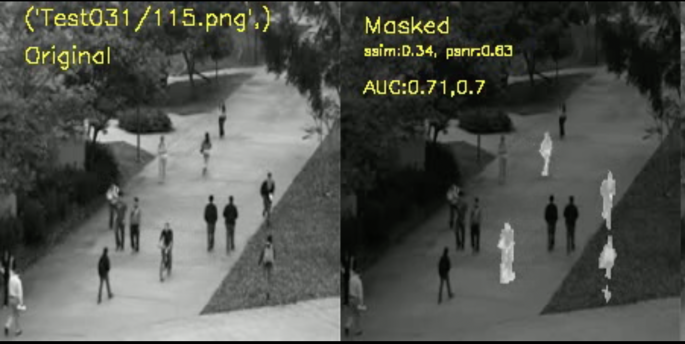

# DENOISING AUTOENCODER WITH TEMPORAL SHIFT MODULE FOR VIDEO ANOMALY DETECTION

Video anomaly detection research has predominantly utilized 3D CNNs and convolutional LSTMs to detect unique events within video streams, capturing both spatial and temporal aspects. However, the complexity of training and deploying these models is challenging due to their high computational demands. An innovative approach involves the Temporal Shift Module (TSM), which effectively employs 2D convolution layers by sharing information between frames, thus simulating pseudo-3D convolutions. TSM introduces minimal additional computation, exhibiting an impressive over 3% latency increase compared to 2D convolution layers. In this study, we propose integrating the TSM module into denoising-oriented deep learning models (TSM-DAE) for anomaly detection, thereby enhancing the models' ability to grasp long-term temporal information. Performance evaluations conducted on UCSDped1 and UCSDped2 datasets demonstrate that TSM-DAE surpasses a baseline model (2DConv-DAE) with matching parameters, achieving a superior AUC by 4% and 2% respectively. While TSM-DAE outperforms LSTM-based convolutional models, it falls slightly short of the performance demonstrated by 3D convolutional models, as evidenced by a comparative analysis against state-of-the-art models in the field.

- [Link to Video Presentation Part1](https://youtu.be/iRTkVjfRJ9s)
- [Link to Video Presentation Part2](https://youtu.be/EITuMqyeZWw)

